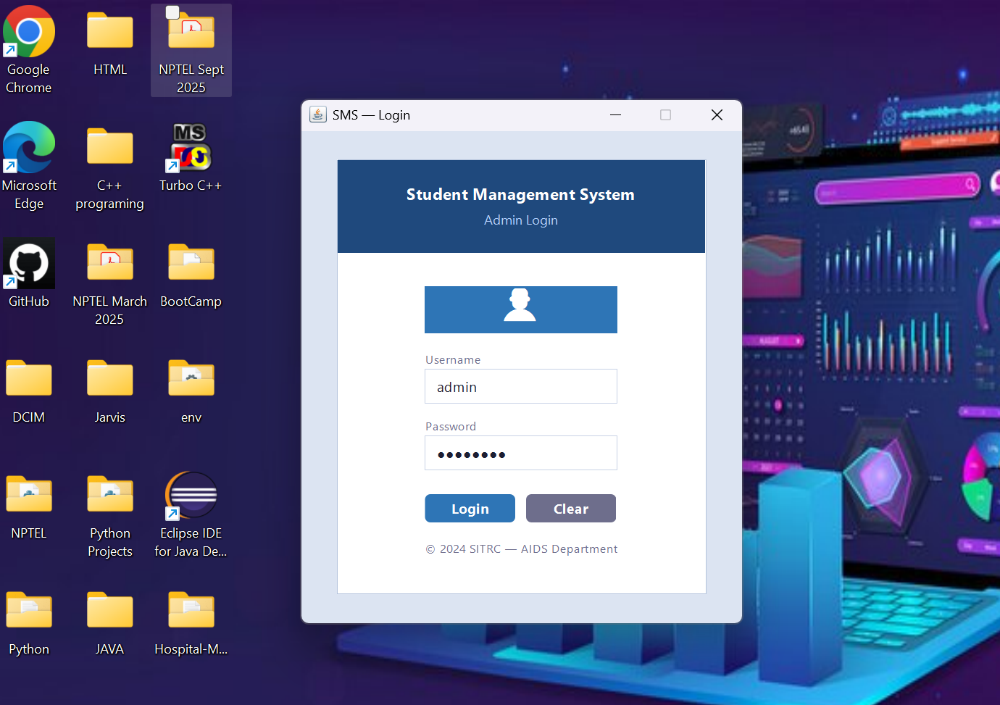
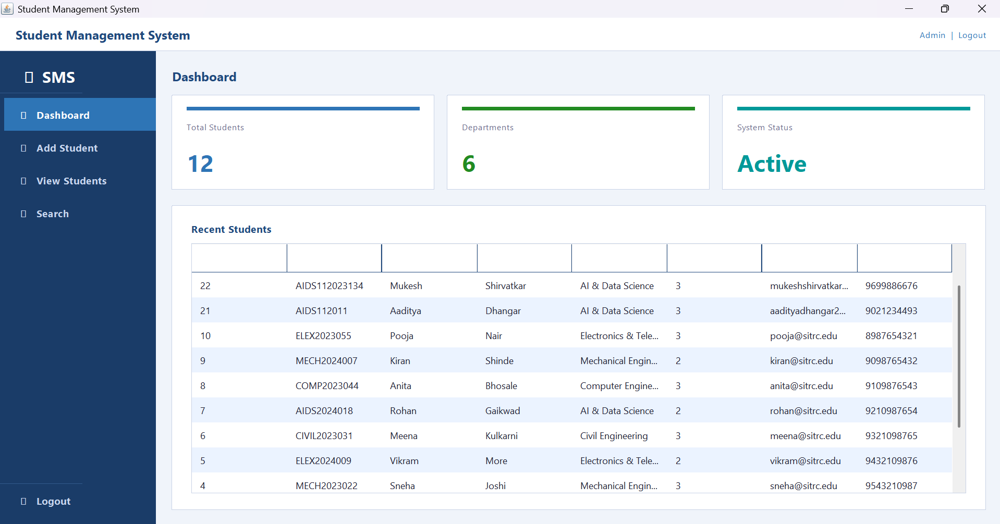
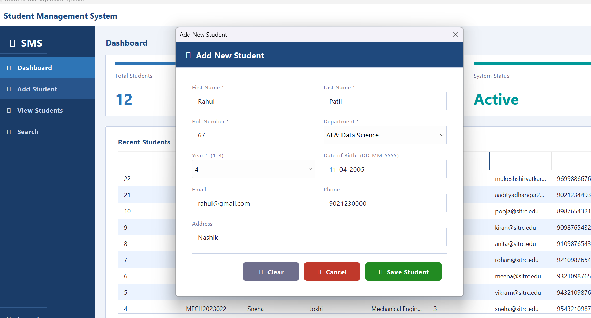
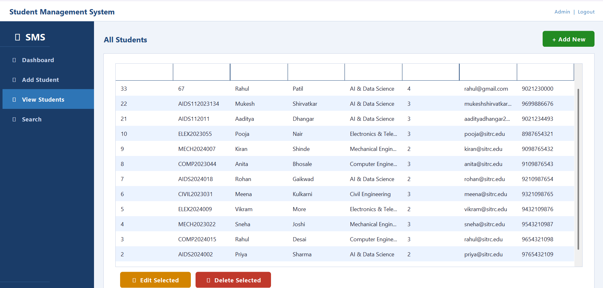
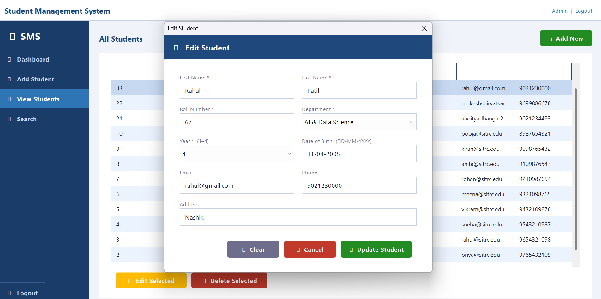
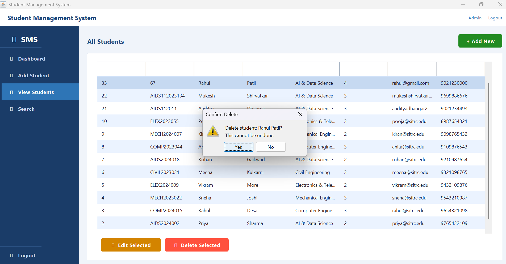
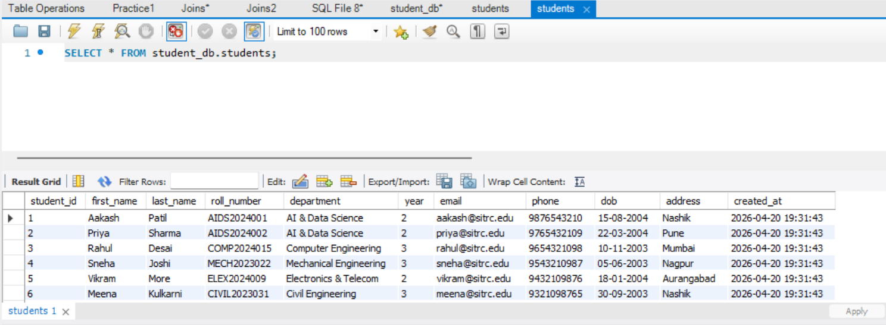

# 🎓 Student Management System

> A Java Swing-based desktop application for efficiently managing student records using MySQL. The system provides secure administrator login, complete CRUD operations, input validation, and a modern graphical user interface.


---

# 📖 Overview

The **Student Management System** is a Java desktop application developed to simplify the management of student records. It provides administrators with a user-friendly interface to securely log in, add, update, delete, search, and manage student information stored in a MySQL database.

The application follows a modular architecture using **Java Swing** for the graphical user interface and **JDBC** for seamless database connectivity.

---

# ✨ Features

- 🔐 Secure Admin Login
- ➕ Add New Students
- ✏️ Update Student Information
- 🗑️ Delete Student Records
- 🔍 Search Students
- 📋 View Student List
- 💾 MySQL Database Integration
- ✅ Input Validation
- 🎨 Modern Java Swing Interface
- ⚡ Fast CRUD Operations

---

# 🛠️ Tech Stack

| Technology | Purpose |
|------------|---------|
| Java 23 | Programming Language |
| Java Swing | Desktop GUI |
| JDBC | Database Connectivity |
| MySQL | Database |
| MySQL Connector/J | JDBC Driver |
| VS Code | Development Environment |

---

# 🏗️ System Workflow

```
 Administrator
       │
       ▼
Login Window
       │
       ▼
 Authentication
       │
       ▼
   Dashboard
       │
       ├───────────────┐
       ▼               ▼
  Add Student      Search Student
       │               │
       ▼               ▼
 Update Student   Delete Student
       │
       ▼
   MySQL Database
```

---

# 📂 Project Structure

```
Student-Management-System/
│
├── src/
│   └── com/
│       └── sms/
│           ├── dao/
│           │   ├── AdminDAO.java
│           │   └── StudentDAO.java
│           │
│           ├── db/
│           │   └── DBConnection.java
│           │
│           ├── model/
│           │   └── Student.java
│           │
│           ├── ui/
│           │   ├── LoginFrame.java
│           │   ├── MainFrame.java
│           │   └── AddEditStudentDialog.java
│           │
│           ├── util/
│           │   ├── UITheme.java
│           │   └── Validator.java
│           │
│           └── Main.java
│
├── lib/
│   └── mysql-connector-j-9.6.0.jar
│
├── Screenshots/
│   ├── login-page.png
│   ├── dashboard.png
│   ├── add-student.png
│   ├── student-list.png
│   ├── edit-student.png
│   ├── delete-confirmation.png
│   └── database-table.png
│
├── student_db.sql
├── README.md
├── LICENSE
└── .gitignore
```

---

# 📸 Application Screenshots

## 🔐 Login Page

Secure administrator authentication.



---

## 🏠 Dashboard

Manage all student records from a single dashboard.



---

## ➕ Add Student

Add a new student with complete details.



---

## 📋 Student Records

View all student records stored in the database.



---

## ✏️ Edit Student

Update existing student information.



---

## 🗑️ Delete Student

Delete a student record after confirmation.



---

## 🗄️ MySQL Database

Student records stored in the MySQL database.



---

# 🚀 Installation

## Clone the Repository

```bash
git clone https://github.com/Aadityadhangar/Student-Management-System.git
```


---

## Import Database

Open **MySQL Workbench**.

Import the file:

```
student_db.sql
```

This will automatically create:

- student_db
- admin table
- students table

---

## Configure Database

Open

```
src/com/sms/db/DBConnection.java
```

Update the database credentials if necessary.

```java
private static final String URL = "jdbc:mysql://localhost:3306/student_db";
private static final String USERNAME = "root";
private static final String PASSWORD = "YOUR_PASSWORD";
```

---

## Add MySQL Connector

Place the following file inside the **lib** folder.

```
mysql-connector-j-9.6.0.jar
```

---

## Compile

```bash
javac com/sms/**/*.java
```

---

## Run

```bash
java com.sms.Main
```

---

# 💻 Default Login Credentials

| Username | Password |
|----------|----------|
| admin | admin123 |

---

# 📊 Database

The application uses **MySQL** to store:

- Administrator Login
- Student Information

Tables:

- admin
- students

---

# 🔒 Security

This repository does **NOT** include:

- Database passwords
- MySQL server configuration
- Sensitive credentials

---

# 🚀 Future Enhancements

- Student Photo Upload
- Attendance Management
- Export to Excel
- Export to PDF
- Dashboard Analytics
- Email Notifications
- Role-Based Authentication
- Cloud Database Support
- Dark Mode
- Backup & Restore

---

# 🎯 Learning Outcomes

This project demonstrates knowledge of:

- Java Programming
- Object-Oriented Programming (OOP)
- Java Swing GUI Development
- JDBC
- MySQL Database
- CRUD Operations
- Exception Handling
- MVC-inspired Project Structure
- Desktop Application Development

---

# 🤝 Contributing

Contributions are welcome!

If you'd like to improve this project:

1. Fork the repository.
2. Create a new branch.
3. Commit your changes.
4. Open a Pull Request.

---

# 👨‍💻 Author

**Aaditya Rajendra Dhangar**
B.Tech – Artificial Intelligence & Data Science
Sandip Institute of Technology & Research Centre, Nashik

# 🌐 Connect with Me

[](https://www.linkedin.com/in/aaditya-dhangar-70a20728a)
[](https://github.com/Aadityadhangar)
📧 Email: aadityadhangar25@gmail.com

---

# 📜 License

This project is licensed under the **MIT License**.

---

## ⭐ If you found this project useful, consider giving it a Star!
